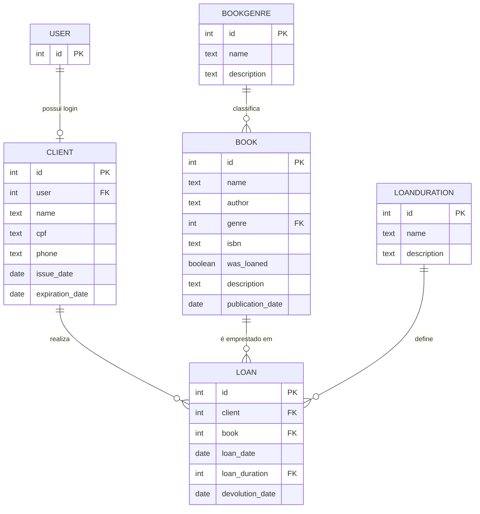

# Biblioteca Admin

Sistema de gestão de biblioteca construído com Django, focado no cadastro de clientes, livros e no controle de empréstimos — do início ao fim, direto pelo Django Admin.

Permite gerenciar clientes, livros, gêneros literários, durações de empréstimo e empréstimos, com automações via signals (status do livro, cálculo de expiração de cadastro) e controle de permissões por grupo (clientes e funcionários).

Desenvolvido com django-environ para configuração via variáveis de ambiente e Jazzmin para personalização visual do admin.

## Requisitos

- Python 3.12+

## Instalação

```bash
# Clone o repositório
git clone <url-do-repositorio>
cd projeto_bibilioteca

# Crie e ative um ambiente virtual
python3 -m venv venv
source venv/bin/activate
# Windows: python -m venv venv && venv\Scripts\activate

# Instale as dependências
pip install -r requirements.txt
```

## Configuração

Copie o arquivo de exemplo e preencha as variáveis:

```bash
cp .env-example .env
```

```dotenv
SECRET_KEY=
DEBUG=True
ALLOWED_HOSTS=127.0.0.1,localhost
```

> ⚠️ Este projeto é destinado a ambiente de desenvolvimento. Mantenha `DEBUG=True` no `.env`. Com `DEBUG=False`, o Django deixa de servir arquivos estáticos (logo, CSS, JS do admin) automaticamente — para produção, seria necessário configurar um servidor de arquivos estáticos (ex: whitenoise ou nginx).

## Configurando o banco de dados

As migrations precisam ser aplicadas em duas etapas. Isso acontece porque a app `setup` cria grupos e permissões que dependem de permissions geradas automaticamente pelo Django *após* a migração das outras apps — rodar tudo num único `migrate` falha por causa dessa ordem.

Primeiro, aplique as migrations de todas as apps, exceto `setup`:

\`\`\`bash
python manage.py migrate --skip-checks $(python manage.py showmigrations --list | grep -v setup)
\`\`\`

> Se preferir, rode explicitamente cada app: `python manage.py migrate book`, `client`, `loan`, `admin`, `auth`, `contenttypes`, `sessions`.

Depois, aplique a migration de setup, que cria os grupos "clientes" e "funcionários" com as permissões corretas:

\`\`\`bash
python manage.py migrate setup
\`\`\``

## Uso

```bash
python manage.py runserver
```

Acesse `http://127.0.0.1:8000` no navegador e faça login com o superusuário criado.

### Estrutura de permissões

| Grupo | Permissões |
|-------|------------|
| **Clientes** | Apenas visualização de livros |
| **Funcionários** | CRUD completo em clientes, livros, gêneros, durações de empréstimo e empréstimos; também pode criar, visualizar e editar usuários (`User`), necessário para vincular login aos clientes |

- Todo `Client` é vinculado a um `User` individual (login próprio), criado pelo funcionário via admin.
- A entrada nos grupos "clientes" e "funcionários" é manual, feita pelo superusuário/funcionário ao criar o usuário.
- Ao registrar um empréstimo, o livro correspondente é marcado automaticamente como emprestado.
- A data de expiração do cadastro do cliente é calculada automaticamente (emissão + 1 ano).

## Modelo de dados



## Rodando os linters

O projeto segue a ordem `isort` → `black` → `flake8`:

```bash
isort .
black .
flake8
```

## Quer saber mais?

Este README cobre o básico para você rodar o projeto rapidamente. Para detalhes de arquitetura, apps e decisões técnicas, consulte a **documentação completa** gerada com MkDocs.

Para visualizar a documentação localmente:

```bash
mkdocs serve -a 127.0.0.1:8001
```

Depois é só acessar `http://127.0.0.1:8001` no navegador. A documentação atualiza automaticamente conforme os arquivos são editados.

Se quiser gerar a versão estática (por exemplo, para hospedar em algum lugar):

```bash
mkdocs build
```

Isso vai gerar o site pronto na pasta `site/`.
