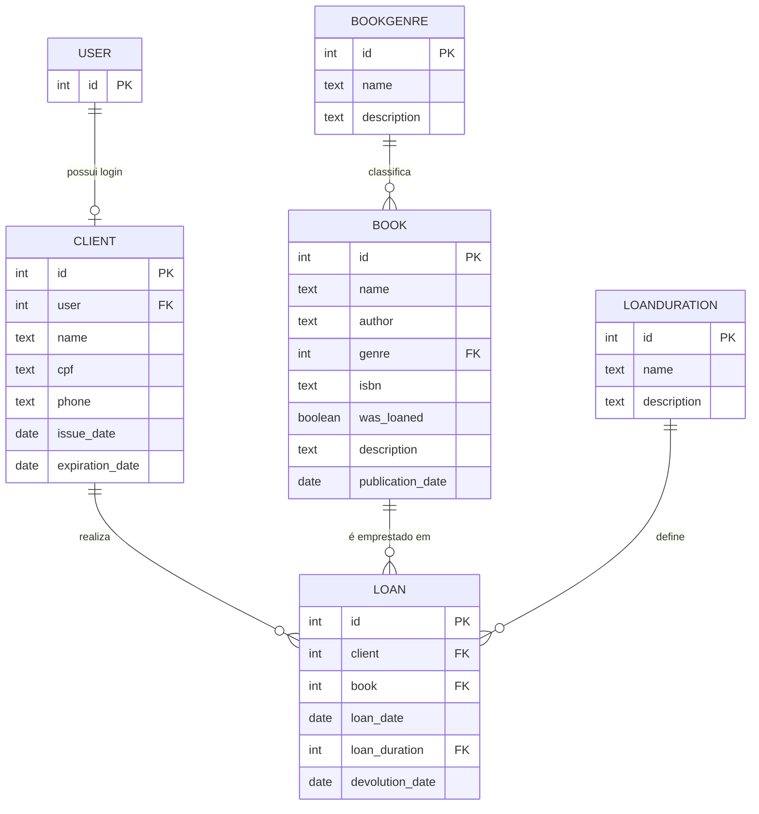

# Modelo de dados

## Notas sobre os campos

- **`Client.expiration_date`** — calculado automaticamente como um ano após `issue_date`. Veja **[Signals](signals.md)**.
- **`Book.isbn`** — possui `unique=True`, garantindo que não existam livros duplicados por ISBN.
- **`Book.was_loaned`** — atualizado automaticamente via signal ao registrar um `Loan` para aquele livro.
- **`Loan`** — todas as *foreign keys* (`client`, `book`, `loan_duration`) usam `on_delete=PROTECT`, impedindo a exclusão de clientes, livros ou durações que já têm empréstimos associados.
